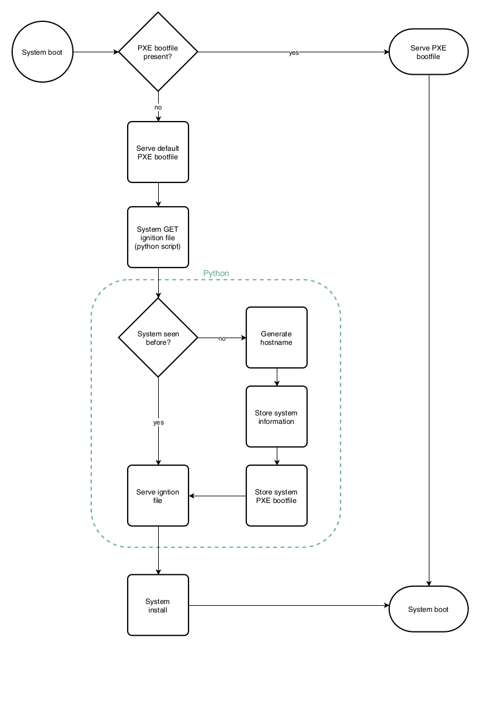

# dynamic-ignition-coreos
Return a dynamic ignition file to a booting system

This is just a proof of concept to show that it should not be very hard to provide a booting Fedora CoreOS system with a dynamic generated ignition configuration file. To use this, create a DHCP/PXE/HTTP server and use for example the dhcpd.conf and pxelinux.cfg/default configuration provided below. Download Fedora CoreOS to the webroot of the HTTP server and execute the `serve_ignition.py` script. 
Boot a system, let it PXE and choose the 'Install Fedora CoreOS' option. If the host was not seen before, a syslinux bootfile is generated and a ignition is served which will install and configure Fedora CoreIS on it. Was the host already known to the system, the bootfile is provided which will let the host boot from the local disk.

Since a picture is worth a thousand words, the flow...




## /etc/dhcp/dhcpd.conf
```
key defomapi {
	algorithm hmac-md5;
	secret s0nIEoYP74zdh9OuPXcW0A==;
};

omapi-key defomapi;
omapi-port 7911;

default-lease-time 60;
max-lease-time 120;
option subnet-mask 255.255.255.0;
option broadcast-address 172.16.10.255;
option routers 172.16.10.1;
option domain-name-servers 192.168.10.1;
option domain-search "install";

subnet 172.16.10.0 netmask 255.255.255.0 {
  range 172.16.10.100 172.16.10.254;
  filename "pxelinux.0";
  next-server 172.16.10.1;
}
```

## /var/lib/tftpboot/pxelinux.cfg/default
```
default menu.c32
prompt 0
timeout 30
ONTIMEOUT 1

menu title ########## CentOS 7 PXE Boot Menu ##########

label 1
menu label ^1) Install Fedora CoreOS
menu default
kernel fedora-coreos/vmlinuz
append ip=dhcp rd.neednet=1 initrd=fedora-coreos/initramfs.img console=tty0 console=ttyS0 coreos.inst=yes coreos.inst.install_dev=vda coreos.inst.image_url=http://172.16.10.1/fedora-coreos-metal/fedora-coreos-30.20190905.0-metal.raw.xz coreos.inst.ignition_url=http://172.16.10.1:5000/get_ignition
IPAPPEND 2


label 2
menu label ^2) Install CentOS 7
#menu default
kernel centos7/vmlinuz
append initrd=centos7/initrd.img method=http://172.16.10.1/centos7 devfs=nomount


label 3
menu label ^2) Boot from local drive
localboot 0
```